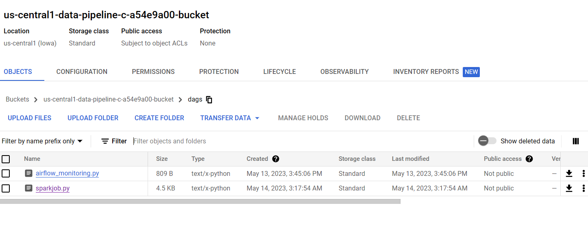

# My-first-data-engineer-project-Datapipeline-For-Simulate-data-cleaning-
โปรเจคนี้ เป็นการทดลองการทำความสะอาดข้อมูลโดยใช้ Dataproc ในการรัน sparkjob บน Google Cloud Platform ร่วมกับการสร้าง Data pipeline โดยใช้ Apache Airflow บน Composer ซึ่งเป็นบริการ Orchestration  
และใช้ในการดึงข้อมูลจาก storage ต่างๆมาประมวลผลตามลำดับ โดยเมื่อทำความสะอาดข้อมูลเสร็จแล้วจะนำข้อมูลนั้นๆไปใส่ใน Google bigguery โดยสร้างตารางตามความต้องการของผู้ใช้งาน(สมมุติขึ้นมา)เพื่อใช้ในการวิเคราะห์ข้อมูลต่อไป
# Dataset ที่ใช้
ผมได้ใช้ Dataset จาก 
https://raw.githubusercontent.com/databricks/Spark-The-Definitive-Guide/master/data/retail-data/all/online-retail-dataset.csv 
ซึ่งเป็นข้อมูล Online retail เนื่องจากมีข้อมูลให้ทำความสะอาดข้อมูลหลากหลายรูปแบบ ในการทำความสะอาดข้อมูลนั้นผมได้สมมุติ requirements ต่างๆขึ้นมาในการทำความสะอาดข้อมูลตาม requirement นั้นๆ
ซึ่งขึ้นตอนการทำความสะอาดข้อมูลสามารถดูได้ที่ https://colab.research.google.com/drive/1uSM2Xirctb1LBwOgNQiSky7WkWqP6_Kh?usp=sharing และสามารถ Download **cleansing_data.ipynb** ใน github ได้เลยครับ 
# Datapipeline

# การเตรียมการสำหรับ Datapipeline 
## 1.สร้าง cloud storage 2 bucket 
1.retail-data-forcleansing 2.spark-job-cleansingdata (จำลองการแยกเป็นส่วนๆ อาจไม่ใช best practice) \
อัพโหลด retail.csv ไปที่ retail-data-forcleansing bucket และ อัพโหลด tranformation.py ไปที่ spark-job-cleansingdata \

## 2. create cloud composer

ทำการ upload sparkjob.py ไปที่ folder Dag ใน bucket ที่สร้างขึ้นอัตโนมัติเมื่อสร้าง composer (bucket ที่เชื่อมกับ composer ในการใส่ Dag เพื่อแสดงใน airflow) 

ตัวของ Dag จะแสดงใน UI ของ apache airflow 

# การทำงานของ Datapipeline 

1.เริ่มจากการ print date โดยใช้ BashOperator จาก sparkjob.py เป็นการแสดงวันที่ออกทาง log ใน cloud composer หรือ apache airflow \
2.เสร็จแล้วสร้าง dataproc cluster โดยใช้ DataprocCreateClusterOperator โดยสร้าง cluster ตาม config ที่ได้บันทึกไว้ใน sparkjob.py \
3.ทำการทำความสะอาดข้อมูลตามขั้นตอนใน cleansing_data.ipynb \
3.1 เริ่มจากการดึงข้อมูลใน retail.csv ใน retail-data-forcleansing bucket \
3.2 ทำการดึง tranformation.py ที่อยู่ใน spark-job-cleansingdata bucket และใช้ DataprocSubmitJobOperator เพื่อรัน pyspark โดยทำความสะอาดข้อมูลตามลำดับขั้นตอน \
3.3 บันทึกข้อมูลในที่ทำความสะอาดแล้วใน folder data ที่ cloud composer สร้างขึ้น \
4.ลบ dataproc cluster โดยใช้ DataprocDeleteClusterOperator \
5.ทำการย้ายข้อมูลใน data ไปสู่ bigquery โดยสร้าง schema ของ table ใน bigquery ตาม config ใน GCSToBigQueryOperator 

